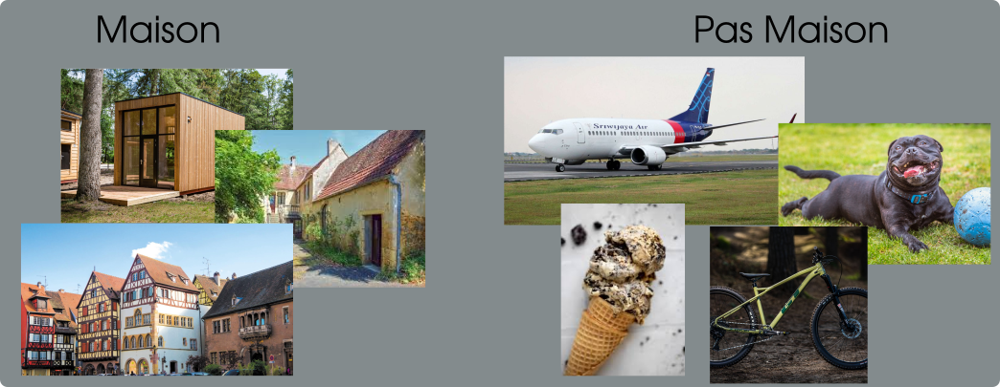
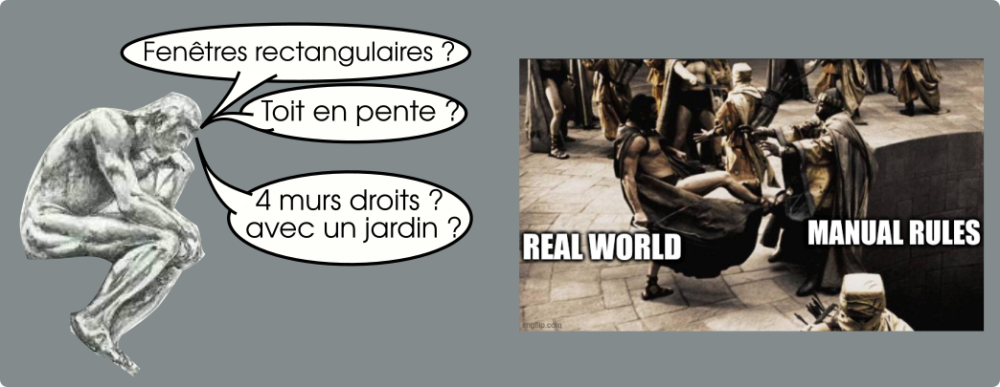
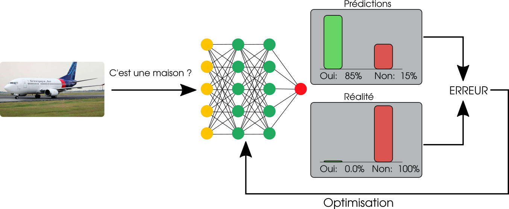

# Motivation 

  
  

### Une croissance digne des plus grands moments du Bitcoin 

Pour comprendre les mécanismes du *pump* dans l'évaluation de l'intérêt du Deep Learning, il est nécessaire d'appréhender les problématiques des chercheurs en vision par ordinateur au début des années 2010. 
Imaginons que l'on désire écrire un programme permettant de déterminer si une image représente une maison ou un avion: 

L'approche traditionnelle consiste à réfléchir très fort et très longtemps pour trouver une manière de distinguer les instances de maisons des instances qui ne le sont pas. À très haut niveau, on pourrait par exemple: 

* Essayer de repérer des carrés pour les fenêtre, le toit, les portes
* Si tous ces éléments sont présent, alors on peut conclure que l'image contient une maison. 

On comprend aisément que cette réflexion est d'une solidité toute relative. En effet, on peut facilement imaginer qu'une maison ait des fenêtres circulaires, que le toit ne soit pas visible depuis le point de prise de vue et moults autres configurations dans l'immense diversité du monde réel qui réduisent l'efficacité de nos règles à néant. 

C'est sur cet aspect spécifique que les techniques d'apprentissages se démarquent et sont particulièrement attractives puisqu'elles permettent, à travers la définition d'une *erreur / fonction de coût* d'optimiser directement les prédictions

