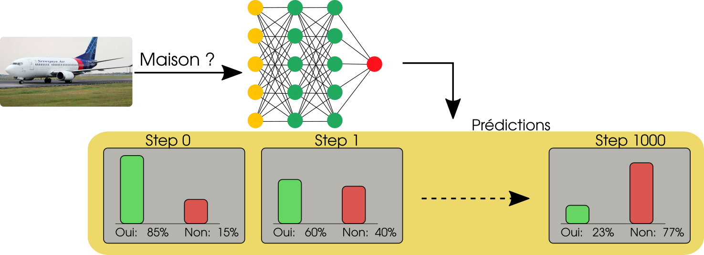
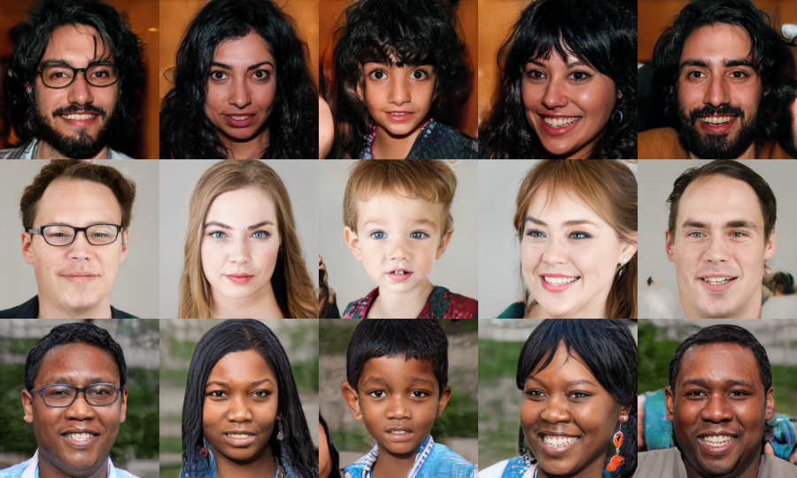
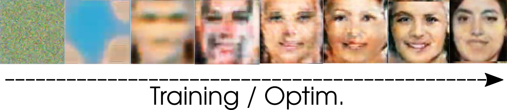

# Motivation 

**Mais concrètement, ça veut dire quoi optimiser les prédictions en fonction d'une erreur ?** 

## Dans le cas de la classification avec des réseaux de neurones: 

Les réseaux de neurones sont optimisés de manière itérative: c'est-à-dire que leur réponses sont progressivement modifiées jusqu'à atteindre les valeurs attendues. 

D'un point de vue technique, les réseaux de neurones sont paramétrés par des *poids* qui leur servent à faire leur prédictions (aka prendre leur décision) et ce sont ces paramètres qui sont modifiés par l'optimisation. Mais on y reviendra plus tard. 

## Génération de données

Laissons de côté la classification, qui, en dépit de l'aspect central et fondamental de ce type de tâche, peut parfois manquer d'entrain. La génération/synthèse de données est un domaine dans lesquels les réseaux de neurones se sont brillament illustrés. En particulier, les GAN (Generative Adversarial Network) ont démontré des capacités stupéfiantes dans la génération de visages synthétiques: 

Ce type de résultat est obtenu à l'issue d'un processus d'entrainement dit *adversarial* puisqu'il met en jeu deux réseaux de neurones qui essaient de se tromper mutuellement. Comme on peut le voir sur la figure ci-dessous, on part initialement de loin. Et l'optimisation non-linéaire, ça marche.

## Une architecture très polyvalente

Au final, la flexibilité est un des points les plus marquants du machine learning sous sa forme actuelle. C'est un aspect qui est particulièrement marqué dans les réseaux de neurones puisque l'optimisation (par backpropagation) permet, avec un peu de créativité de positionner ces modèles sur un très large panel de problèmes. Par exemple 

* Classification et régression (prédire une ou plusieurs valeurs), mais ça, on le savait 
* Détection d'object, segmentation d'images (classifier tous les pixels d'une image, utile pour la conduite autonome, notamment)
* Génération d'images, de sons 
* Interprétation du langage, résumer des textes, recherche d'informations
* Contrôle et commande de robots, entrainement d'agents 
* Estimation de la profondeur à partir d'une image RGB
* Deviner la forme des éléments occultés sur une image 
* Accélérer des simulations physiques 
* Avec un dataset approprié, on peut générer des cartes sur Minecraft, des heightmaps pour des terrains 3D... 

The sky's the limit, lorsqu'on dispose d'un bon dataset, d'une fonction de coût bien pensée (et de quelques GPUs). 