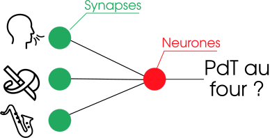
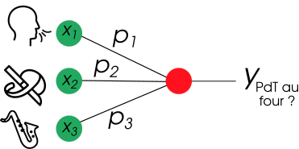
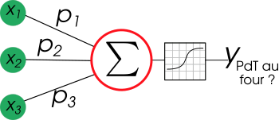
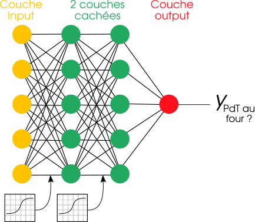

# Motivation 

Maintenant, rapprochons nous de la question qu'on se pose tous: comment ça marche les réseaux de neurones ? 

### Concept 

Initialement, l'architecture des réseaux de neurones est librement inspirée du fonctionnement du cerveau. En gros, l'idée c'est que les neurones du cerveau reçoivent des sollicitations / excitations sous forme de courant électrique qui peuvent activer ou inhiber le neurones. C'est typiquement ce qu'il se passe lorsqu'on sent une odeur en rentrant dans une pièce par exemple: les neurones supposés détecter les herbes de provence sont activés par les émanations des pommes de terre au four. 

En pratique, c'est légèrement plus compliqué puisque le cerveau crée en réalité des connexions entre les neurones et les renforce si ces connexions sont fréquemment utilisées. Pour avoir une métaphore pédagogique, on peut imaginer que le processus d'apprentissage comme une personne qui [marche dans une forêt vierge](http://rire.ctreq.qc.ca/2016/03/apprentissage-cerveau/): au départ, il est difficile pour l’apprenant de se déplacer d’un point à un autre dans la forêt. Il doit écraser les branches et les feuilles afin de tracer un sentier. Or, plus il repasse souvent dans un sentier, plus il est facile pour l’apprenant d’y circuler. En revanche, s’il n’emprunte pas souvent un sentier, celui-ci disparait petit à petit, car la végétation repousse. C'est précisément cette idée qui a inspiré l'architecture des NN (Neural Networks). 

### Le neurone solo 

Avant de les grouper et d'en faire des réseaux, il faut comprendre le fonctionnement du neurone. Pour reprendre l'exemple précédent, imaginons que le neurone considéré soit celui chargé de signaler si des pommes de terres sont en train de cuire dans le four. 
Ce neurone est connecté à trois synapses qui amènent différentes informations: 
* l'odeur des herbes de Provence  
* si les yeux ont détecté des épluchures de pommes de terre
* si quelqu'un joue du saxophone dans la rue 

On peut représenter cette configuration par l'image ci-dessous: 

En pratique, les synapses ne transmettent pas directement l'information au neurones. En effet, le signal est typiquement pondérée pour représenter son importance. 

D'un point de vue plus formel, plus mathématique (parce qu'il en faut un peu, quand même), on peut noter: pour des signaux $$x_i$$, des poids $$p_i$$, le niveau d'activation $$ y $$ du neurone est la somme pondérée des signaux: $$y_{pdt} = \sum x_i \times p_i$$

En réalité, la véritable force des NN leur vient par l'utilisation d'une fonction d'activation non-linéaire, qu'on peut noter $$f$$ avant d'arriver au résultat. On a donc: $$y_{pdt} = f(\sum x_i \times p_i)$$

### Les réseaux de neurones 

Même si un neurone isolé, c'est sympa, ça manque généralement de punch pour considérer des problématiques plus complexes. Suivant le diction *l'union fait la force*, la stratégie la plus fréquente consiste à grouper les neurones en couches et à mettre des couches les unes à la suite des autres. On nomme généralement: 
* La première couche -> couche d'*input*
* La dernière couche -> couche d'*output* / prédiction
* Les couches intermédiares -> couches cachées 

Le principe de calcul pour un neurone expliqué au-dessus est appliqué à tous les neurones de toutes les couches. En pratique, ça veut dire que: 
* Le neurone 1 de la première couche cachée reçoit une combinaison linéaire de tous les neurones de la couche d'input 
* Le neurone 2 de la première couche cachée reçoit une combinaison linéaire (mais différente) de tous les neurones de la couche d'input 
* Bis repetita pour tous les neurones de la première couche cachée
* Bis repetita pour tous les neurones de la seconde couche cachée
* Et finalement, la prédiction du réseau (couche output) est obtenue en applicant encore le même principe entre la dernière couche cachée et la couche d'output. 

### Conclusion (Ce dont il faut se rappeler) 

* Les NN sont composés d'assemblages de neurones 
* Les niveau d'activation d'un neurone solo dépend de ses *inputs* et de leur pondération
* On repète ce calcul pour tous les neurones de toutes les couches
* Après la somme pondérée, une non-linéarité est appliquée, permettant aux NN d'approximer des processus complexes.  
