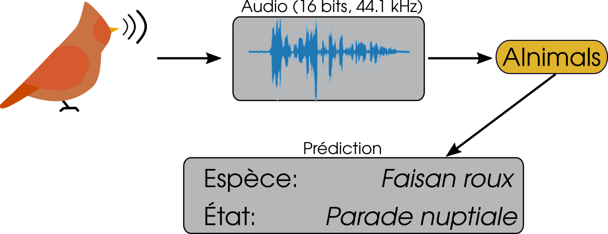
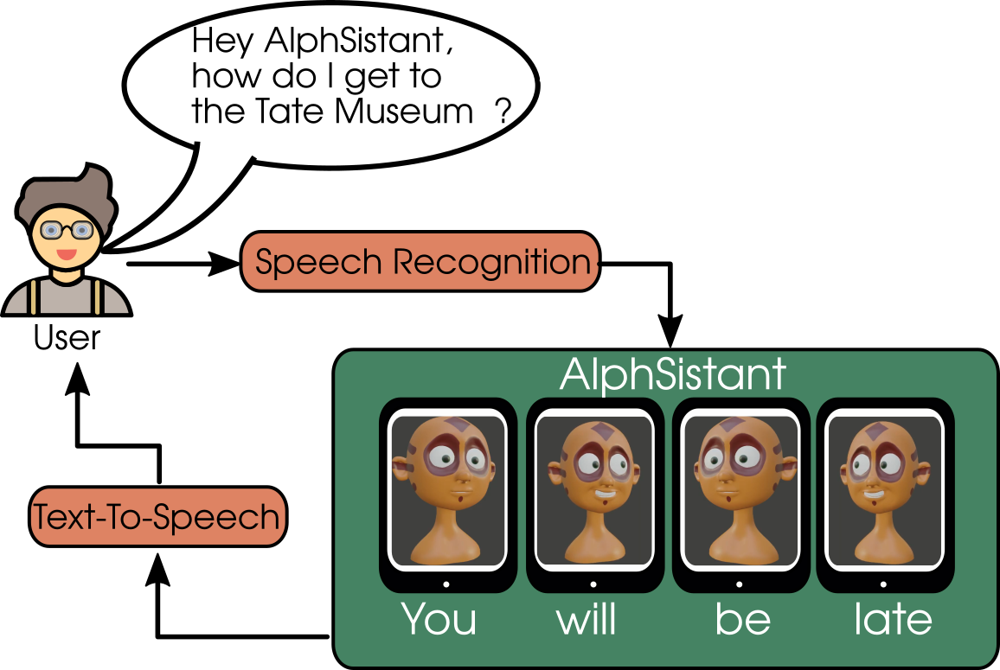

# Les projets 

La motivation principale de ce site est d'assurer la productivité des ressources intégrant AInimals ou AlphSistant, qui se basent tous les deux fortement sur les techniques d'IA et impliquent une grande diversité de concepts, parmi lesquels: 
* Deep Learning en général
* Computer Vision (CV)
* Audio processing 
* Contrastive Learning 
* Generative Modelling

Cette page présente la vision de chacun des projets et comment ces notions techniques s'articulent dans la démarche 

# AInimals 

AInimals, c'est un peu un Shazam pour ornithologues, ta petite reconnaissance automatique d'oiseaux de poche. En collaboration avec OSI, une ONG internationale qui propose des séjours de science participative, l'objectif est de créer un modèle capable de détecter les différentes espèces d'oiseaux (ça, c'est un peu classique) mais aussi l'état des oiseaux (ça, c'est plus original). 

D'un point de vue technique, c'est le projet le plus *direct*: il s'agit en effet d'un problème de classification (multi-classes, quand même) supervisé. C'est-à-dire qu'on dispose du dataset avec d'une part les enregistrements et de l'autre les labels (les réponses) et que l'essentiel du travail du projet consiste à entrainer un modèle qui soit suffisamment précis pour être utile. La tâche est loin d'être triviale, bien entendu, mais sur le plan conceptuel, c'est déjà calé. Ce volet des travaux implique du traitement du signal pour générer des spectrogrammes qui seront utilisés comme base d'apprentissage par un CNN (Audio processing + Computer Vision + Deep Learning)

Typiquement, les modèles qui seront générés dans ces travaux comportent plusieurs dizaines de millions de paramètres et peuvent peser plusieurs centaines de Mo. Si ce n'est pas grand chose pour un PC de calcul moderne avec un GPU, c'est autrement plus conséquent pour les appareils plus modestes sur lesquels on désirera à terme embarqué le modèle. 

Parce qu'évidemment, pour que ces travaux aient un sens et soient utiles, on ambitionne de déployer le modèle dans la nature pour pouvoir, par exemple, évaluer l'impact de construction sur la faune locale et comme on ne va pas laisser une station de calcul dans la forêt, il nous faudra une solution plus compacte. Ceci implique donc des travaux originaux et pleins de tests sur les notions de compressions/pruning/fp16... It's gonna be amazing. (Deep Learning + Model Compression) 

# AlphSistant

Sur le projet AlphSistant, on a une latitude opératoire plus large. Le but de ce projet, c'est de préparer un modèle qui, en écoutant un audio, est capable de prévoir les déformations du visage. Du coup, en appliquant ces déformations à un modèle 3D (un maillage), on devrait pouvoir donner l'impression que c'est le personnage virtuel qui a prononcé ces mots. Plus schématiquement, l'idée c'est de donner une représentation corporelle à un chatbot et du coup d'en faire quelque chose de dynamique et réactif.

### Euh, pourquoi ? 

Au cas où tu ne serais pas au courant, l'animation (en particulier 3D et réaliste), à un coût astronomique puisque, dans les workflows modernes, ça nécessite à minima: 
* Des experts en animation
* Du matériel onéreux
* Des acteurs
* Du post-processing 

Et le pire, c'est que c'est très peu réutilisable ! Là, on capte direct l'intérêt d'un modèle qui serait capable de déformer un maillage instantanément à partir d'un son, non ?  

Partant de ce consensus, il faut prendre en considération plusieurs aspects pour atteindre notre objectif: 
* Contrôle du maillage: mouvements prédéfinis vs contrôle direct du maillage 
* Données: données pré-existante vs construction d'un dataset vs mix 
* Type de modèle: GAN vs supervision 
* (Pour Mehdi) Comme VAE, apprendre un modèle des déformations et l'utiliser pour loss directe 

Dans tous les cas, les données audio seront traitées de manière similaire à AInimals (Audio processing), passées à un CNN pour le calcul des représentations latentes (Deep Learning + Computer Vision) et les prédictions seront utilisées pour déformer le maillage (Rendering + in-engine control). Can't wait! 