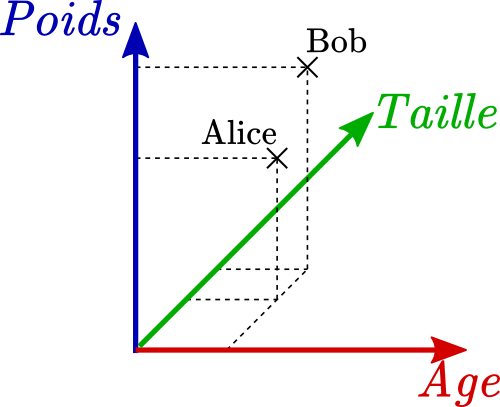
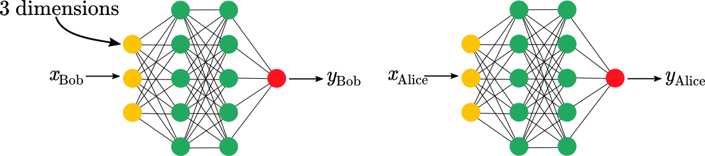
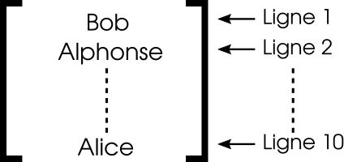
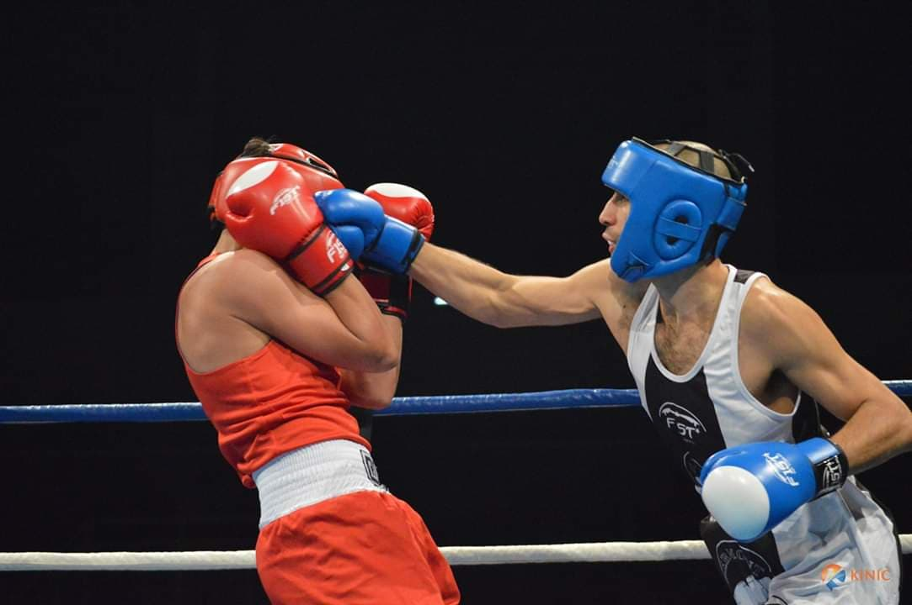
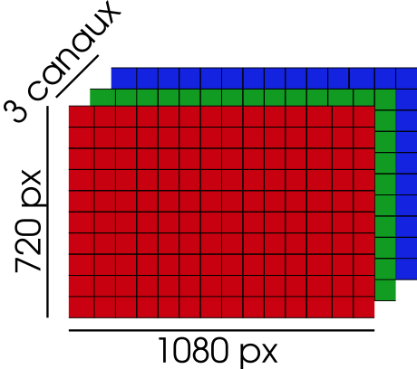
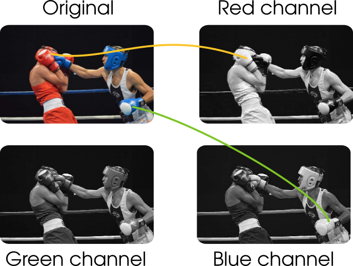
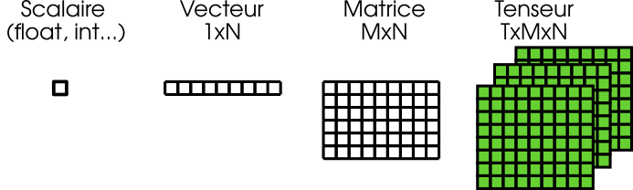

# Représentation numérique des informations 

Comme mentionné [ici](e_post.md) et [là](d_post.md), les couches NN opèrent une série d'opérations mathématiques (typiquement somme pondérée et fonction non-linéaire) sur les informations qui leur sont fournies (souvent par la couche précédente) pour créer une représentation de ces informations et les passer à la couche suivante, jusqu'à obtenir une prédiction. Si tout cela te semble très confus et abstrait, tu es au bon endroit puisque ce post est destiné à présenter plusieurs exemples, après lesquels les vecteurs, matrices et tenseurs n'auront plus de secrets pour toi. 

## Le vecteur

Imaginons qu'on désire décrire numériquement (aka avec des chiffres) une personne donnée. Pour ce faire, on peut choisir plusieurs valeurs qui permettront de représenter le sujet d'intêret. Ces valeurs peuvent être très diverses, du coup, dans le cadre de cet exemple, choisissons de manière arbitraire: 

* La taille 
* Le poids 
* L'age 

Hence, meet Bob, un jeune cadre dynamique de 28 ans mesurant 1.8m pour 75kg. Numériquement, on peut écrire le *vecteur Bob*:

$$x_{Bob} = [1.8, 75, 28] $$ 

On peut même placer Bob dans l'espace (de dimension 3, puisqu'il y a trois composantes):

Meet also Alice, une autre jeune cadre dynamique, représentée par $$x_{Alice} = [1.65,60,28]$$ qu'on peut également placer sur le graphe:  

Admettons que Bob et Alice fassent partie d'un grand dataset qui contient les représentations de tous les habitants d'Auvergne. On désire passer ces vecteurs à un NN pour faire des prédictions: comment faire ? 

La stratégie la plus intuitive serait de passer successivement chacun des vecteurs au NN pour obtenir sa prédiction. 

Bien que triviale, cette approche n'est en pratique jamais employée: on prefère **empiler** les représentations sur une dimension supplémentaire et passer l'ensemble au NN pour un traitement en parallèle (entre autres raisons). C'est-à-dire: 
* Le vecteur de Bob et d'Alice consiste, pour chacun, en 3 composantes
* On rajoute une dimension: le vecteur est maintenant de dimension $$1 \times 3$$ (une ligne, trois colonnes)   
* On peut alors les empiler et obtenir une matrice $$2\times3$$ (deux lignes (Bob et Alice) et trois colonnes)
* Si on disposait de 10 personnes, la matrice obtenue serait de taille $$10\times 3$$ (10 lignes et 3 colonnes)

## Les matrices

On a vu au-dessus que les vecteurs étaient utilisés pour représenter des informations et qu'on pouvait les empiler et créer des matrices pour leur traitement par des NN. Cette stratégie peut être étendue à des dimensions supplémentaires. Considérons par exemple le cas d'une photo: 

Les images en couleur sont généralement composées de 3 canaux RGB: il s'agit en fait de trois matrices de la taille de l'image qui indiquent l'intensité de chaque pixel pour les couleurs rouge, vert et bleu.  

La figure ci-dessous montre la décomposition de la photo en ces différents canaux et l'intensité des pixels correspondant: plus un pixel est blanc, plus il est *activé* (intense), voir mes petites flèches.  

D'un point de vue *shape*, cette image de 3 canaux, avec 1080x720 pixels est un tenseur (matrice 3D) de dimension 3x 1080 x 720. Dans l'éventualité d'une image RGBD (enregistrement de la profondeur en plus), on aurait aussi un tenseur 3D, mais de dimension 4x 1080 x 720. 

Similairement au cas des vecteurs, si on veut donner plusieurs (disons 7) images RGB simultanément au modèle, alors on aura un input de shape: 7x3x1080x720. 

### Les tenseurs 

Eh bien, il n'y a pas grand chose de plus à rajouter, à vrai dire: un tenseur, c'est juste une matrice avec un nombre de dimensions supérieur à 2. Mais au-delà de ça, ça peut être n'importe quoi. Par exemple, imaginons qu'on désire entrainer un modèle à calculer des images intermédiaires dans une vidéo (par exemple, pour faire des slow-mo). Pour ce faire, on décide de donner au modèle les 5 frames d'avant et les 5 frames d'après la zone à prédire. Pour un exemple unique en RGB, on aurait alors la shape: 1x30x1080x720 (1 exemple, 10 images x 3 canaux, pixels width, pixels height). Et si on décide d'empiler 8 exemples, alors on obtient un input de taille: 8x30x1080x720. 

### Conclusion (ce qu'il faut retenir)

* Les informations sont représentées par des valeurs numériques 
* Ces valeurs sont rangées dans différents format
* Et peuvent être empilées pour montrer plusieurs exemples simultanément au modèle
* Pour empiler, rajouter une dimension devant. 

